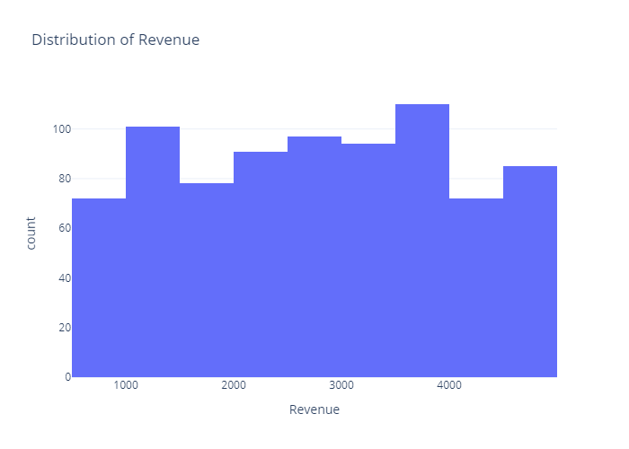
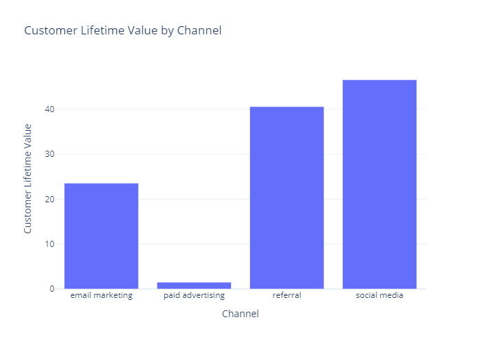

# Customer Lifetime Value Analysis

## Overview

The Customer Lifetime Value (CLTV) Analysis project aims to evaluate the effectiveness and efficiency of various customer acquisition channels by analyzing cost per conversion, revenue per conversion, and overall return on investment (ROI). The analysis is conducted using Python and various data visualization libraries to gain insights into how different marketing channels contribute to customer acquisition.

## Exploratory Data Analysis (EDA) performed:

### Distribution of Acquisition Cost and Revenue:
- To get the common revenue ranges and cost distributions.

### Cost by Channel:
- To identify the most and least cost-effective channels.

### Conversion Rate by Channel:
- To determine the effectiveness of each channel in converting leads into customers.

### Revenue by Channel:
- To understand which channels contribute most significantly to revenue.

### Return on Investment (ROI) by Channel:
- To assess the profitability and effectiveness of marketing spend.

### Customer Lifetime Value (CLTV) by Channel:
- To evaluate long-term value generated per dollar spent on marketing.

### CLTV Distribution:
- To understand variability and performance of channels.

### Cost per Conversion:
- To compare the cost-efficiency of each channel.

### Revenue per Conversion by Channel:
- To compare the revenue generation of each channel.

## Conclusion

This project builds on the foundational work provided in The Clever Programmer's Customer Lifetime Value Analysis using Python by expanding the analysis to provide deeper insights into various other aspects of the CLTV analysis.

## References:
1. [Customer Success Metrics](https://blog.hubspot.com/service/customer-success-metrics)
2. [Project Reference](https://thecleverprogrammer.com/2023/05/01/customer-lifetime-value-analysis-using-python/)
3. [Dataset](https://statso.io/customer-lifetime-value-analytics-case-study/)
